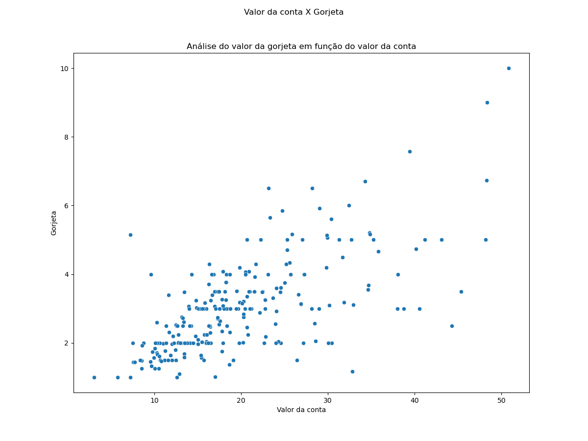

# Descrição do projeto

Análise da base de dados "Gorjetas", proveniente da biblioteca Seaborn. O objetivo do projeto, é executar a análise exploratória dos dados, definir a distribuição dos dados, assim como o comportamento de cada um dos atributos, por exemplo, a proporção entre o valor da conta e o valor da gorjeta, a influência da sobremesa, linha de tendência, etc. Testes de hipóteses para o valor médio da conta e da gorjeta, em comparação aos dias da semana e para o periodo do dia.

# 1. Base de dados

A base de dados utilizada está disponível pelo link: https://www.kaggle.com/datasets/leonardobolek/anlise-de-gorjetas

Nome: Análise de gorjetas

O dataset possui 244 registros, e os seguintes atributos:
| **Atributos** | **Descrição** |
| ------------------- | ------------------- |
| Conta | Valor da conta |
| Gorjeta | Valor da gorjeta dada ao garçom |
| Sobremesa | Se o cliente pediu ou não a sobremesa |
| Dia | Dia da semana na qual o cliente frequentou o restaurante |
| Hora | Periodo (Almoço/Jantar) |
| Ocupantes | Quantas pessoas ocupavam a mesa |

# 2. Tratamento de dados

A base de dados está disponível em inglês, logo para melhor compreensão, foi feita a tradução das colunas e dos registros.

Não foram encontrados valores faltantes (NA), ou com tipos de variáveis inadequadas.

# 3. Análise valor da conta e gorjeta

Para analisar a relação entre o valor da conta e a gorjeta, um gráfico de dispersão foi plotado entre os dois atributos e apresentado abaixo:

Aparentemente, há uma progressão linear entre o valor da conta e o valor da gorjeta, ou seja, quanto maior for a conta, maior será a gorjeta. Porém, ainda não é possível afirmar se os dados são proporcionais. Para aferir se há ou não essa proporcionalidade, uma análise de porcentagem é necessária.

Logo um gráfico de dispersão entre valor da conta e porcentagem de gorjeta no valor da conta, junto com uma linha de tendência, ilustra melhor se há a presença ou não, de proporcionalidade entre os dados:

Com a apresentação da linha de tendência, relacionado a porcentagem da gorjeta, presente no valor total da conta, fica claro que a gorjeta não é proporcional. Mesmo que o valor dado, aumenta com o valor da conta, a proporção é maior para valores mais baixos.

