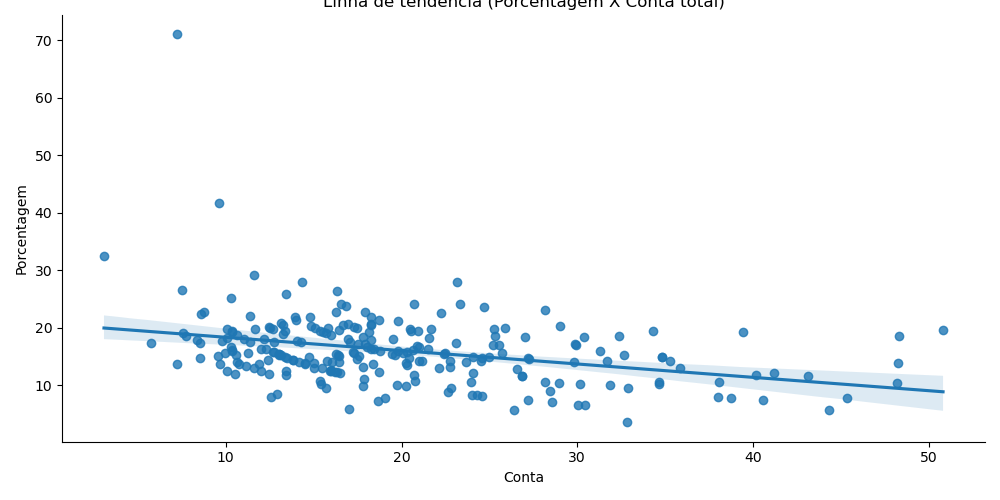
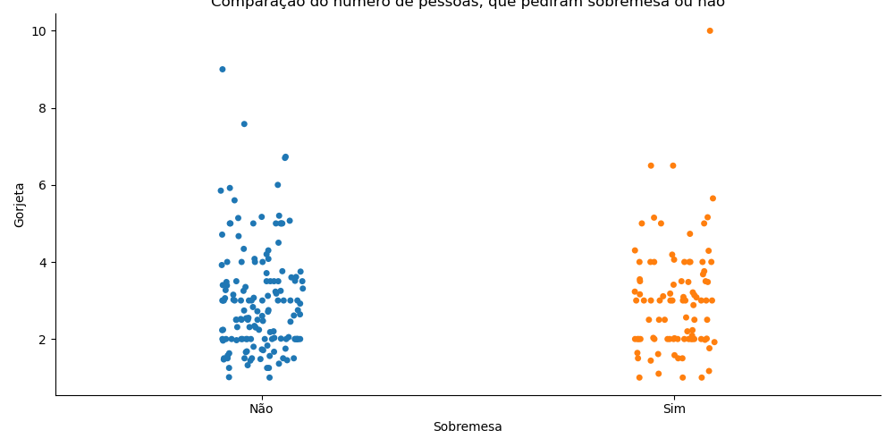
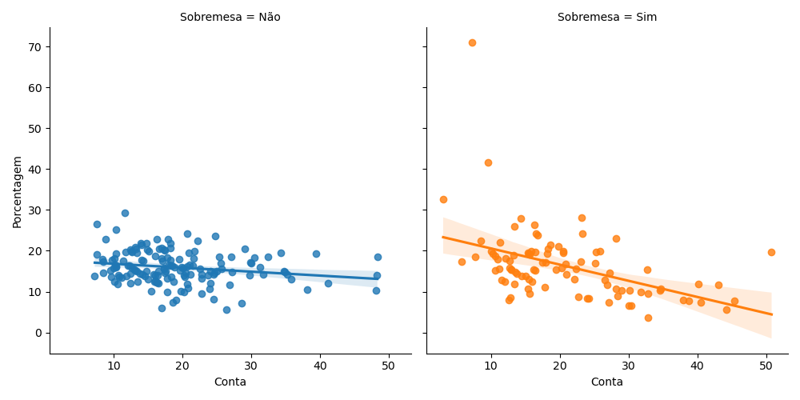
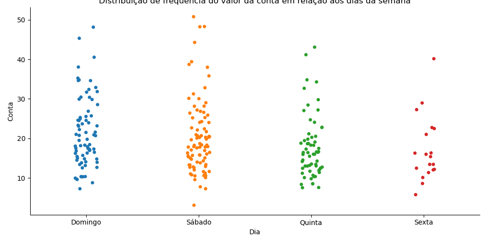
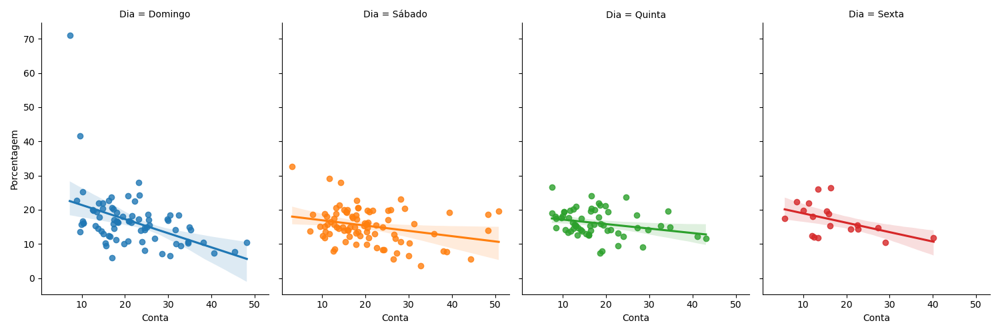
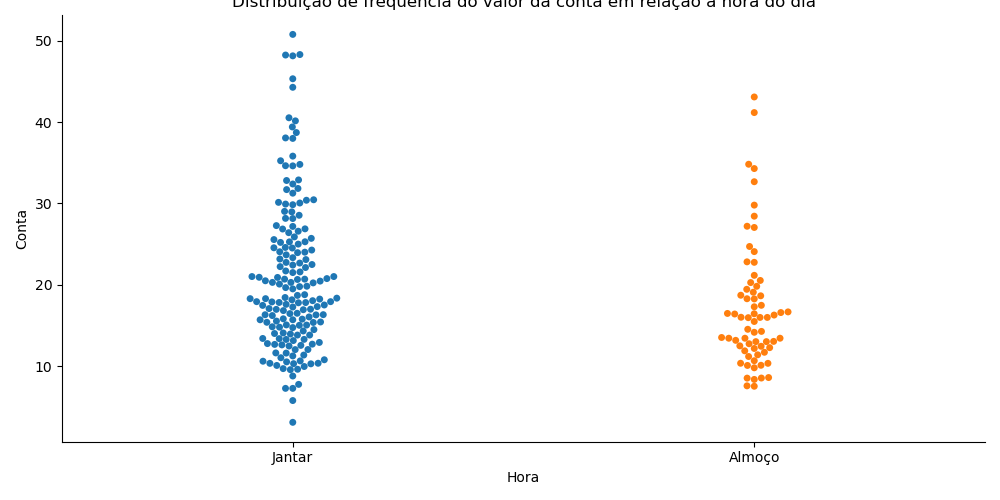
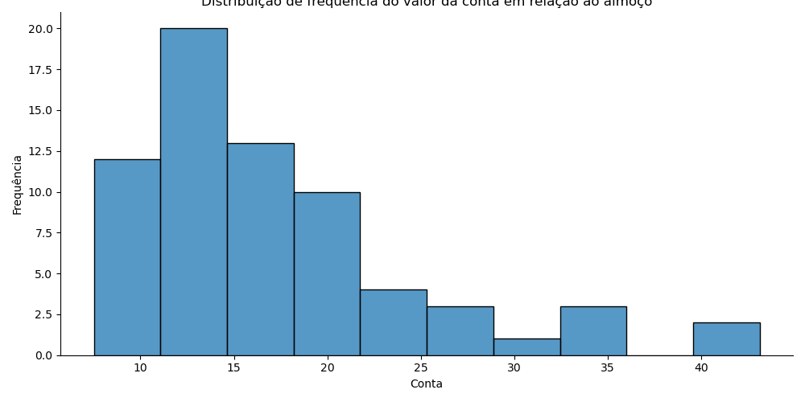
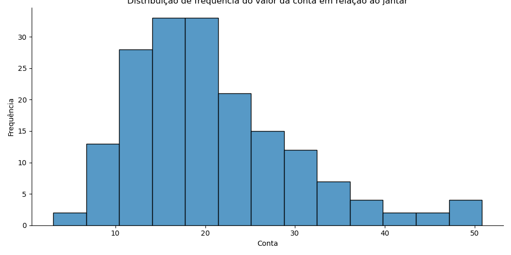

# Descrição do projeto

Análise da base de dados "Gorjetas", proveniente da biblioteca Seaborn. O objetivo do projeto, é executar a análise exploratória dos dados, definir a distribuição dos dados, assim como o comportamento de cada um dos atributos, por exemplo, a proporção entre o valor da conta e o valor da gorjeta, a influência da sobremesa, linha de tendência, etc. Testes de hipóteses para o valor médio da conta e da gorjeta, em comparação aos dias da semana e para o periodo do dia.

# 1. Base de dados

A base de dados utilizada está disponível pelo link: https://www.kaggle.com/datasets/leonardobolek/anlise-de-gorjetas

Nome: Análise de gorjetas

O dataset possui 244 registros, e os seguintes atributos:
| **Atributos** | **Descrição** |
| ------------------- | ------------------- |
| Conta | Valor da conta |
| Gorjeta | Valor da gorjeta dada ao garçom |
| Sobremesa | Se o cliente pediu ou não a sobremesa |
| Dia | Dia da semana na qual o cliente frequentou o restaurante |
| Hora | Periodo (Almoço/Jantar) |
| Ocupantes | Quantas pessoas ocupavam a mesa |

# 2. Tratamento de dados

A base de dados está disponível em inglês, logo para melhor compreensão, foi feita a tradução das colunas e dos registros.

Não foram encontrados valores faltantes (NA), ou com tipos de variáveis inadequadas.

# 3. Análise valor da conta e gorjeta

Para analisar a relação entre o valor da conta e a gorjeta, um gráfico de dispersão foi plotado entre os dois atributos e apresentado abaixo:

Aparentemente, há uma progressão linear entre o valor da conta e o valor da gorjeta, ou seja, quanto maior for a conta, maior será a gorjeta. Porém, ainda não é possível afirmar se os dados são proporcionais. Para aferir se há ou não essa proporcionalidade, uma análise de porcentagem é necessária.

Logo um gráfico de dispersão entre valor da conta e porcentagem de gorjeta no valor da conta, junto com uma linha de tendência, ilustra melhor se há a presença ou não, de proporcionalidade entre os dados:

Com a apresentação da linha de tendência, relacionado a porcentagem da gorjeta, presente no valor total da conta, fica claro que a gorjeta não é proporcional. Mesmo que o valor dado, aumenta com o valor da conta, a proporção é maior para valores mais baixos.

# 4. Análise atributo sobremesa

Separando em duas classes, entre clientes que pediram sobremesa, e os que não pediram, há o gráfico do tipo catplot apresentado abaixo:

Dos 244 clientes que passaram pelo restaurante, 151 não pediram sobremesa, enquanto 93 pediram, o equivalente a 61.88% dos clientes. É possível notar levemente essa diferença no gráfico.

O maior valor de gorjeta foi dado por alguém que pediu sobremesa. O valor foi de 10 dolares, enquanto a maior gorjeta dada por alguém que não pediu sobremesa, foi de 9 dolares, o que mostra baixa influência do atributo sobremesa no valor da gorjeta. 

O valor médio da gorjeta foi bem próximo também, 3.00 e 2.99, o que reforça essa análise.

O valor médio da conta foi de 20.76 dólares para clientes que pediram, e 19.19 dólares para os clientes que não pediram, valores relativamente próximos. Um teste de hipótese foi feito, para definir se é possível considerar o valor médio da conta para os dois grupos o mesmo ou não.

A um nível de confiança de 95%, o valor médio da conta é igual para quem pede sobremesa e para quem não pede sobremesa.

O gráfico de dispersão entre valor da conta e a porcentagem de gorjeta, em relação a sobremesa é apresentado a seguir:

A porcentagem da gorjeta, não altera com o valor da conta, para os clientes que não pedem sobremesa. É possível observar isso, com a linha horizontal do gráfico. Para os clientes que pedem sobremesa, a porcentagem de gorjeta cai de 25% para aproximadamente 10%, conforme o valor da conta aumenta. A explicação mais plausível, é que o cliente compensa ou descompensa a falta ou não da sobremesa, na gorjeta do garçom. Um teste de hipótese foi feito para análisar essa possibilidade.

A um nível de confiança de 95%, a distribuição da taxa de gorjeta é a mesma nos dois grupos, reforçando a baixa influência do fator sobremesa, no valor da gorjeta fornecida pelo cliente.

# 5. Análise - Dia da semana

Distribuição de frequência do valor da conta, em relação aos dias da semana:

Os dias de sábado e domingo, são claramente os dias mais movimentados, recebendo 87 e 76 clientes respectivamente. Esses dois dias em específico, também receberam os maiores valores de conta, sendo 50.81 reais para o sábado e 48.17 reais para o domingo. O dia com a menor frequência é o de sexta feira, o que pode ser uma indicação de que o cardápio servido nesse dia não atrai a clientela.

Realizando a análise da porcentagem de gorjeta em relação ao valor da conta, pelo dia da semana, obteve-se o gráfico:

Para todos os dias, as porcentagens caem conforme o valor da conta aumenta. Os dias que a linha de tendência apresenta maior inclinação, são o domingo e a sexta.

Domingo é o dia com a maior média de gorjetas, e a maior média do valor da conta. Sábado, apesar de ser o dia mais cheio do restaurante, apresenta a menor porcentagem de gorjeta, enquanto sexta, que é o dia com menor movimento, apresenta a maior taxa de gorjeta. Uma explicação possível, é que com uma quantidade menor de clientes, o garçom pode desempenhar seu trabalho com melhor qualidade, por ter mais tempo para atender cada mesa. 

Um teste de hipotese foi feito para averiguar se a distribuição do valor da conta, para sábado e domingo são iguais ou diferentes. E com um nível de confiança de 95%, chegou-se a conclusão de que a distribuição do valor da conta é a mesma para o sábado e o domingo.

# 6. Análise - Hora do dia

Analisando a frequência de clientes no restaurante, em relação ao periodo do dia, chegou-se a conclusão, que no jantar, o estabelecimento recebe 176, contra 68 no almoço, ou sejaa, 72.13% da clientela.   Com auxílio do gráfico abaixo, essa discrepância se torna mais clara:

É perceptível que o valor da conta é maior para o jantar, sendo 20.79 dólares contra 17.16 dólares para o almoço. 

Analisando o gráfico de frequência pelo valor da conta, para o período do almoço e do jantar, é apresentado os seguintes gráficos de barras:

Para o gráfico do almoço, há uma maior frequência para o valor de 12 a 17 dolares, enquanto para o periodo do jantar, entre 15 a 20 dolares, próximo as respectivas médias. O valor médio e a porcentagem da gorjeta, é de 3.10 reais e 15.95% respectivamente para o jantar, e 2.73 reais e 16.41% para o almoço.

Outro fator analisado, foi a quantidade de clientes que pediram sobremesa nos respectivos periodos. No almoço, 23 pessoas pediram sobremesa, enquanto no jantar 70 clientes requisitaram o prato. Uma possível explicação, é que no almoço, os clientes tendem a estar com mais pressa, devido ao trabalho, ou compromissos do dia-a-dia, enquanto na janta, há uma liberdade maior de tempo, possibilitando a permanência no restaurante por um periodo maior, o que leva a mais gastos no resturante. 

Para definir se, o valor da conta e do valor da gorjeta, são a mesma para o almoço e o jantar, testes de hipótese foram realizados, e com nível de confiança de 95%, conclui-se que a distruição referente o valor da conta é diferente para os dois períodos, enquanto a distribuição da gorjeta é a mesma para o almoço e o jantar.

# 6. Conclusão

